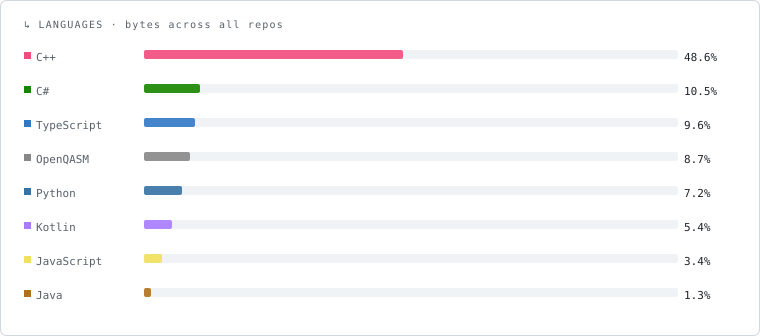
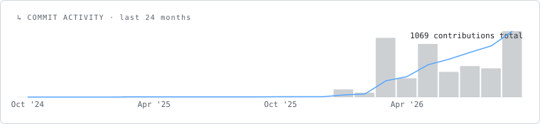

# Sricharan Suresh

Building at the boundary of quantum theory and shipped software —
Ising Hamiltonians, blind-signature protocols, NFC campus systems.

---

## Research

| | Title | Venue | Status |
|--|-------|-------|--------|
| 01 | [Merit-Order State Preparation for Budget-Efficient MA-QAOA](https://doi.org/10.21203/rs.3.rs-9533781/v1) | Research Square · preprint | Under review |
| 02 | [Comparative Analysis of Classical and Quantum K-Means Clustering](https://doi.org/10.5281/zenodo.18876209) | Zenodo | Published |
| 03 | Automated Industrial Surface Defect Classification System | — | Seeking venue |

---

## Featured Projects

**[MAD](https://github.com/verycareful/MAD)** — Minimum Ascent Descent optimizer in C++17. Four-phase algorithm that exhaustively finds all global minima of a differentiable 2D loss function using minimum-ascent trajectories, pass-point stacking, and directional exclusion sets. Validated on Himmelblau, Rastrigin, Ackley, and Beale functions.

**[lindblad](https://github.com/verycareful/lindblad)** — C++23 quantum computing framework. Exact and approximate simulators (statevector, density, Clifford, MPS), transpiler passes, noise modelling, and variational primitives (VQE, QAOA, Grover). Self-driven; long-term systems bet.

**[uc-quantum](https://github.com/verycareful/uc-quantum)** — Full factorial benchmark of 44 MA-QAOA variants for Unit Commitment in power systems. Novel contributions: Merit-Order State Preparation, physics-informed mixer weights, Power Orbits, Layerwise-Progressive training. Preprint under review at Research Square.

**[NotBigBrother](https://github.com/Zonde246/NotBigBrother)** *(w/ [zParik](https://github.com/zParik))* — Double-blind cryptographic age verification using Chaum blind signatures. Neither the issuer nor the verifying website can surveil the user.

**[StEAM](https://github.com/verycareful/StEAM_cs)** — Cross-platform student late-arrival tracker with NFC (MIFARE Classic), OCR, and barcode scanning. Ships as both a .NET MAUI app and an Android (Kotlin + Compose) app.

---

## Stack

**Quantum / ML**

**Systems / Apps**

**Web**

---

## Languages

---

## Activity

---

## Contact

